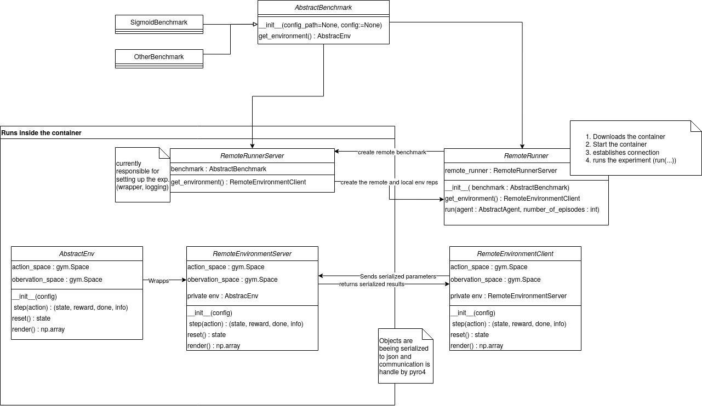

# Container Roadmap

This document describes how we want to use containerization and what needs to be implemented.

There is also a project in the repo called [Containerization](https://github.com/automl/DACBench/projects/2), 
containing more fine-grained tasks and descriptions. This document serve as a overview of the project. 

## Purpose / Requirements
We want to use containers, more precisely [Singulariy Container](https://singularity.hpcng.org/), in order to:

1. Make the experiments (more) reproducible: reduce dependency of external tools such as compilers, interpreters and hardware
2. Easier executable: no need to install everything manually just download DACBench, and it will automatically install the container on request
3. Ensure same version of dependencies  and DACBench for same experiments: publish container versions for each experiment / publications 
4. Enable existent of benchmarks with conflicting dependencies: through separate containers

This includes:

* The benchmarks 
* The baselines

Additional requirements are: 
* The user should not have to deal with the container directly (except installing the container system)
* No need for `root` to run the container (rules out Docker)
* Low overhead

## Architecture
To fulfill these requirements we adapt the architecture introduced in [HPOBench](https://github.com/automl/HPOBench). 

For questions and support ask: 
* Philipp Mueller (muelleph@cs.uni-freiburg.de)
* Katharina Eggensperger (eggenspk@cs.uni-freiburg.de)
how kindly offered their help.

The main idea is to run the components that have either complicated dependencies or are crucial to be reproducible in a container together with a server that exposes the objects via http / sockets to the outside and provide a wrapper for the objects that automatically retrieves and starts the relevant container and acts as proxy so that the user does not notice she/he is communicating with a component within a container.



 Workflow of remote benchmark execution:
```python
benchmark = SigmoidBenchmark()
# adapt default config or load from file
benchmark.set_seed(42) 

# gets and start container for benchmark version from specific experiment / this also defines what is logged, which wrappers are used 
# maybe improved / made configurable later
remote_runner = RemoteRunner(benchmark, experiement_identifier="exp:0.01")

# set up and agent for the baselines we also need a containerized version (todo)
agent = agent_creation_function(remote_runner.get_environment())

# run the experiment for n episodes
# logs are written to local file and are retrievable afterwards
remote_runner.run(agent, number_of_episodes=10)
```

Classes:
* `dacbench.container.RemoteRunner`: runs on the host system and is reposibible for: downloading the container file, starting the container, connection to the `RemoteRunnerServer` inside of the container and comunicating with the `RemoteRunnerServer` 
* `dacbench.container.RemoteRunnerServer`: creates the environments and executes the experiment loop. Defines the experiment. 
* `dacbench.container.RemoteEnvironmentClient`: Facade object for the actual environment. Exposes a limited interface of the environment. Translates the arguments of the calls to json, invokes the remote call using the serialized arguments and deserializes the returned values. 
* `dacbench.container.RemoteEnvironmentServer`: Warpper of the actual environment that deserializes the arguments, passes the resutls to the environment object, serializes the results and returns them to the  `RemoteEnvironmentClient` 

Todos:
* [ ] Implement automatic download for benchmarks
* [ ] Unify the way serialization is handled (currently in the benchmark and in the environment)
* [x] Communications via sockets currently via http
* [ ] Set up container registry
* [ ] Make dependencies separately installable for each benchmark, create containers for benchmarks and remove all benchmark dependencies from default
  since default is to run in container? 
* [ ] command line interface for remote runner / integrate with `dacbench.runner.run()`. Proposed solution: add common
  baseclass for Runner and RemoteRunner that handles argument parsing and defines interface for method run()
* [ ] Improve experiment setup (currently only one experiment hardcoded in RemoteRunnerServer.get_environment()))
* [ ] Measure performance of containerized version vs. non-containerized version
* [ ] Add guide on how to build own containers also useful for internal usage

## Building and Operating a Container

A container is build based on the description in a `.def` file. The exiting definition files are places in `recipes`.

Currently there is only one definition file available thats building a container containing a full installation
of `DACbench`. This should be changed to separate files per benchmark (group) with common dependencies. Requires
corresponding build targets / extras.

To build the container file from the definition file run:
`singularity build container_file definition_file.def`

Note that you need either to run the build process using root or the `--fakeroot` flag:
`sudo singularity build dacbench.sif dacbench/container/recipes/dacbench.def`
or
`sudo singularity build --fakeroot dacbench.sif dacbench/container/recipes/dacbench.def`
